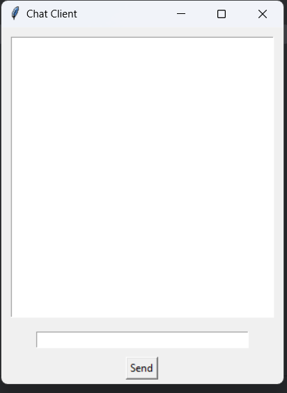

# mgk_labs

In the following project I implemented:
1. Communication between customers.
2. Communication between the client and the server that is implemented using the API of the company OPENAI.

Both the server side and the client side were developed in the Python language

The client side is developed using the "tkinter" library where you can create an interface easily and quickly. and works in a parallel way, receiving the messages as well as sending them

The server side is implemented using the socket library and OPENAI in Python

On the server side, I implemented a way in which the client can communicate between other clients directly with a single client or with all of them at the same time, and of course between a client and an OPENAI chatbot

The way the client can communicate with the OPENAI CHATBOT is implemented in the code, but still for the overall completion of the project I will need a key to the OPENAI service for examination
and to add the ability to bounce a random answer after a time/several messages.

For package management in projects I used PIPENV, not that I had to download a lot of libraries, but that way you can verify and go over the code when running easily.

In order to run the project, the server side must be deployed before deploying the client side
Because it depends on him.

Here is the basic view of the client side. If you would like to see the complete process, I can attach a screen video in which there will be several clients corresponding with each other.

The duration of working on the current project is three hours with breaks and learning new topics such as creating an interface in the Python language.